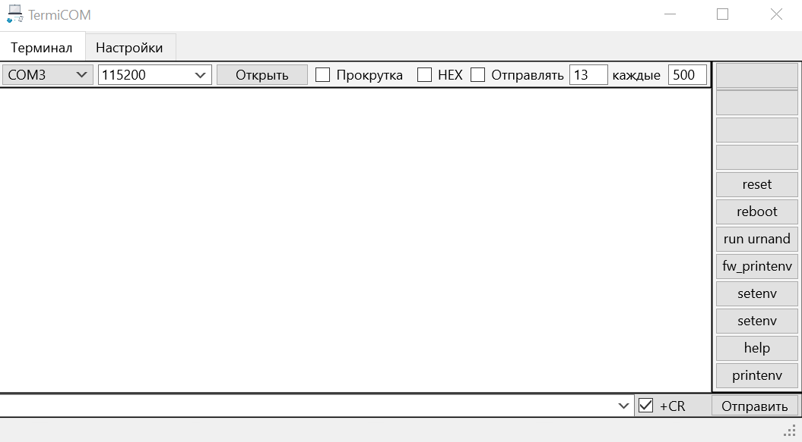

# TermiCOM
Com port send and receive data

Программа для работы c COM портом

1.0 23.08.25
Первая публичная версия. 
Программа умеет определять доступные порты в системе, показываь данные из ком порта в виде текста и шеснадцатиричном формате.

Вывод в ХЕКС формате может работать медленно на больших объёмах данных.

Отправка пока доступна только текстом.
Есть возможность установить быстрые макросы - отправка заранее записанных строк в порт по нажатию кнопки.

Доступна отправка управляющих символов (Ctrl+Z, Ctrl+x, Ctrl+c, Ctrl+v) с клавиатуры.

Есть функция отправки символа в ком порт с заданной периодичностью

TODO: 
- Сделать отправку байт;
- Сделать автоматический ответ при получении определённого набора байт, или текста;
- Сделать сохранение введённых команд;
- Добавить свистоперделок (лампочки отправки и получения данных)
- Добавить возможность создавать свои скрипты (в далёком далёком будущем).

Создано как замена программы Terminal 1.9b и для удобства работы с различнми устройствами.

Автор: Асылгареев Сергей (Serjone)
Гитхаб: https://github.com/serjone123/TermiCOM
Телега: @Serjone123 

Особые благодарности:
- китайцам и нейросети DeepSeek за избавление от рутинных задач.
- Чату https://t.me/fmx_ru в целом и HemulGM (https://github.com/HemulGM) в частности за поддержку и интересные решения. 
- Отдельная благодарность Igor Pavlov, за модуль работы с ком портом, который настолько надёжен, что работает спустя более 20 лет, а также настолько прост, что доступен для понимания даже новичкам. 
